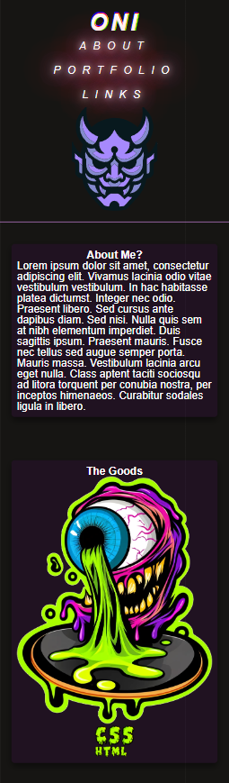
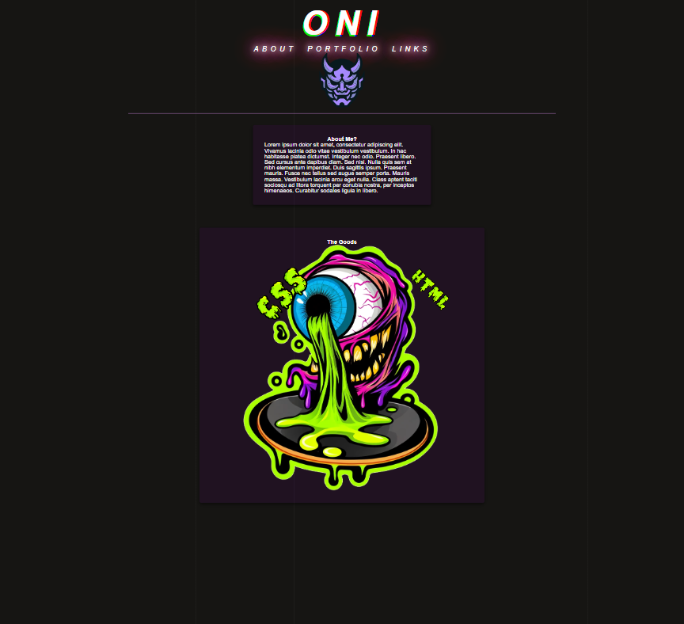

# oni-portfolio

## Description

    Built a portfolio web page using css/html
    This was a testing ground for experimenting with CSS.
    Making different animation types using key frames and shadows. 
    
##  Link
[Live Page](https://odesii.github.io/oni-portfolio/)

## Table Of Content

**1.[Technologies](#technologies)**

**2.[Screen-shots](#screen-shots)**

## Technologies
### Html
### CSS

## Screen Shots

**Mobil**

**Monitor**

## Contact

## Credit

Github supplied logo.
[Github Logo](https://github.com/logos)

